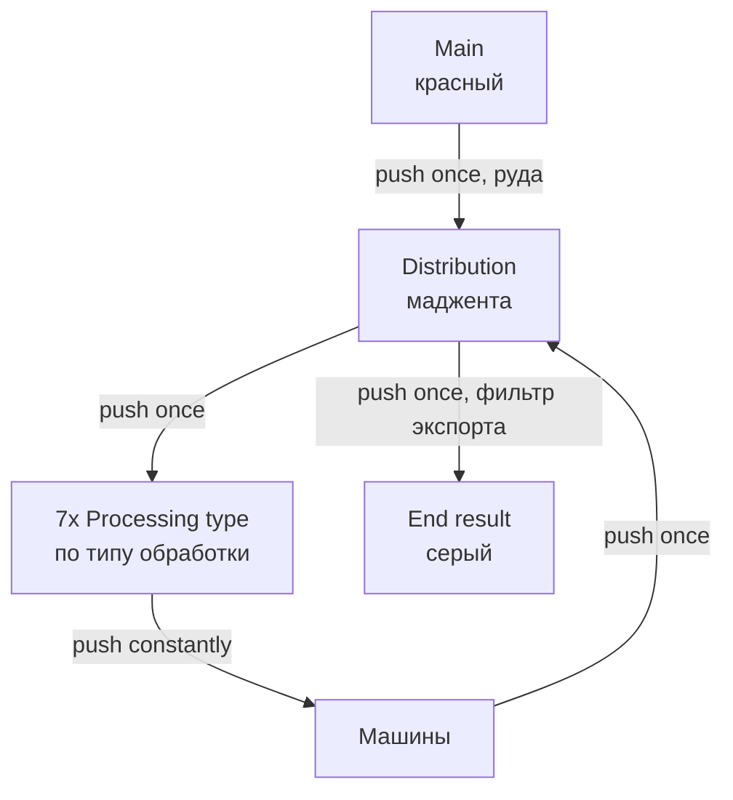

Чиплет обработки руды. Забирает руду из мейннета, гоняет её по цепочке машин и отдаёт наружу только готовый продукт - пыли, кристаллы, слитки. Пассивная линия, см. [[Пассивные линии]].

## Архитектура сети




Логика простая: дистриб — это транзитный хаб, всё крутится через него. Сабнет по типу обработки набивает свои машины, машины кидают результат обратно в дистриб, дальше либо следующий круг, либо экспорт в end result.

Почему так:
- `push constantly` дорог по тикам, поэтому он живёт только на последнем участке сабнет → машины. Везде выше - `push once`.
- Мейн не пушит в end result и не сканирует его постоянно, а видит через view и тянет, когда надо. Дёшево.
- Каждому `push once` нужен фильтр и свободное место в приёмнике. Не будет места — пуш не пройдёт, и предмет молча останется там, откуда должен был уйти. Пары 64к на всякий случай хватает.
- В end result складывается только то, что нам непосредственно надо. Всё промежуточное остаётся внутри орпрока и не засоряет мейн.

> [!important] Как подключать источники руды
> Всё, что пушит руду, подключается в **любом месте красного мейннета**. Что орпрок умеет жрать — он заберёт сам, остальное останется в мейне и не забьёт дистриб. 


### Подсети

| Цвет     | Назначение                                    |
| -------- | --------------------------------------------- |
| Красный  | Мейннет                                       |
| Маджента | Distribution                                  |
| Серый    | End result (серверная стойка тоже серая)      |
| Прочие   | 7 сабнетов по типам обработки, цвет на сабнет |

### Хранилища

| Сабнет            | Диски                                |
| ----------------- | ------------------------------------ |
| Машинные (каждый) | 4x 64к                               |
| Distribution      | 4x 64к + 1x 64к флюидный (под ртуть) |
| End result        | 20x 64к                              |

## Мощность

В пике орпрок потребляет до 33A EV. Питание - 16A IV.

| Машина                   | Количество | Тир |
| ------------------------ | ---------- | --- |
| Macerator                | 6          | EV  |
| Ore Washer               | 1          | EV  |
| Chem Bath                | 1          | EV  |
| Sifter                   | 3          | EV  |
| Thermal Centrifuge       | 8          | EV  |
| Centrifuge               | 16         | EV  |
| Simple Washer            | -          | EV  |
| Forge Hammer             | -          | EV  |
| Amazon Warehousing Depot | -          | EV  |
| Electric air filter      | 2          | T2  |

## Регулярки

Фильтры на импорт в машинные сабнеты.

**Macerator:**

```
^(?:ore|rawOre)(?!(?:(?:Deb|Oi).*)$)[A-Z].*$|^crushed(?:(?:Dee|Hon|Laf|Lead|Sul).*)$|^crushedPurified(?:(?:Chromo|Fluor-|Ira|Kas|LanthaniteL|Mit|Ole|PlatinumM|Vanadio|Yttria).*)$|^crushedCentrifuged[A-Z].*$
```

**Chem Bath:**

```
^crushed(?:(?:Coo|Meteoric|Mit|Nick|Osmi|PlatinumM).*|Iridium|Platinum)$
```

**Ore Washer:**

```
^crushed(?!Purified|Centrifuged)(?!(?:(?:Dee|Hon|Laf|Lead|Sul|Mit|PlatinumM|Coo|Meteoric|Nick|Osmi|HeeEndi|HeeEndP|HeeIg|HeeS|Mon).*|Iridium|Platinum)$)[A-Z].*$
```

**Sifter:**

```
^crushedPurified(?:(?:Amb|Amet|Blue|Cert|Char|Ci|Diam|Dil|Forcic|Forcil|GarnetR|GarnetY|GreenS|InfusedA|InfusedEa|InfusedEn|InfusedF|InfusedO|InfusedW|Lap|NetherQ|NetherS|Op|Pit|Prasi|Quartzi|QuartzS|RedZ|Tanz|Tin|To|Tric).*|Cassiterite|Quartz)$
```

**Thermal Centrifuge** - две штуки, разбито по алфавиту:

```
^crushedPurified(?!(?:Amet|Amb|Blue|Cert|Char|Ci|Chromo|Diam|Dil|Fluor-|Forcic|Forcil|GarnetR|GarnetY|GreenS|InfusedA|InfusedEa|InfusedEn|InfusedF|InfusedO|InfusedW|Lap|LanthaniteL|Mit).*|Cassiterite$)[A-M].*$
```

```
^crushedPurified(?!(?:Ole|Vanadio|Yttria|Ira|Kas|NetherQ|NetherS|Op|Pit|Prasi|Quartzi|QuartzS|RedZ|Tanz|Tin|To|Tric|PlatinumM).*|Quartz$)[N-Z].*$
```

**Centrifuge:**

```
^dustImpure.*$|^dustPure(?:(?:Chromo|Fluor-|Ira|Kas|LanthaniteL|Mit|Ole|PlatinumM|Vanadio|Yttria).*)$
```

И ещё stone dust дописан в эту же регулярку

**Экспорт в End result** (фильтр пуша из дистриба):

```
crushedPurifiedGalena | crushedPurifiedSphalerite | crushedBastnasite | crushedMonazite | *dust* & !dustImpure* & !dustPure*  & !dustStone & !dustMarble | *gem* & !gemChipped* & !gemFlawed*
```

## Ограничения

1. В дистрибе висят все chipped и flawed гемы — фильтр экспорта их не выпускает, а дальше по цепочке они не идут.
