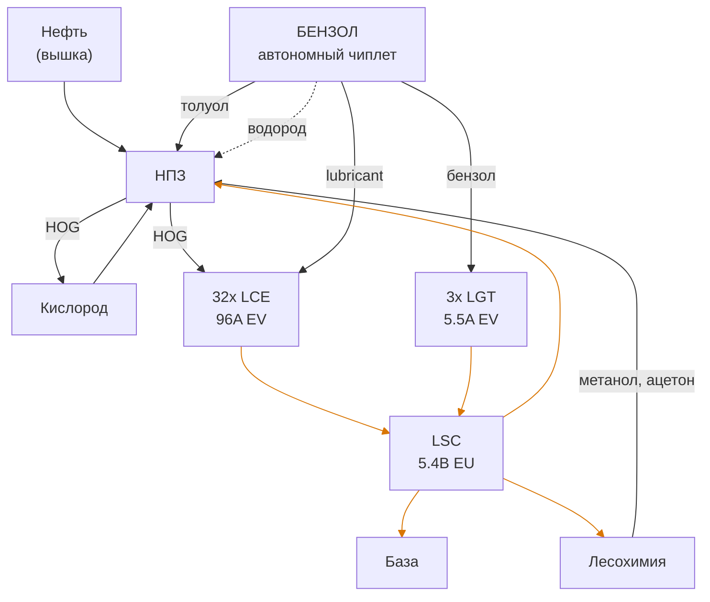

#критическая_инфраструктура 

Вся энергетика базы видна на диаграмме

## Транспорт ЭЭ 
*Rosseti-kuban*

Транспорт ЭЭ осуществляется через EV->IV-LuV трансформаторы, на данный момент LuV провод идёт под землёй на уровне -1 от пола. EV/IV(рабочий) +1 от пола. 

Основная энергосеть - не крашенный 16x HSS-G - 64A LuV -> 256A IV -> 1024A EV
От LCE к LSC - красный 16x HSS-G - 64A LuV -> 256A IV -> 1024A EV
От LCE к LSC - фиолетовый 4x платина - 4A IV -> 16A EV

При транспорте ЭЭ стоит обратить внимание:  
- Не превышать пропускную способность кабеля - не скоро, но когда-нибудь упрёмся
- На общее потребление сети, при превышении пикового потребления будет плохо. Когда теоретическое пиковое потребление превысит текущее выходное - стоит поставить [[#Модификация лсц|ещё один хэтч]] и дополнительно запитать основную магистраль от него
- При передаче ЭЭ на расстояние более 32 768 * 0,05 / 2 ≈ 820 (Voltage tier * 5%-penalty / cable loss) блоков выгоднее использовать ME GT EU P2P, под это настоятельно рекомендуется завести свой динамо хэтч.
- 
## Lapotronic supercapacitor (LSC)
*Филиал АО «СО ЕЭС» «Региональное диспетчерское управление энергосистемы Краснодарского края и Республики Адыгея»*

LSC выполнен на 9 IV ( Σ5.4B EU) капаситорах

Таблица энерджихэчей:

| Тип    | Мощность | Назначение         |
| ------ | -------- | ------------------ |
| Input  | 2x64A EV | Вход генерации LCE |
| Input  | 16A EV   | Вход генерации LGT |
| Output | 4x64A EV | Общий выход        |

На LSC при помощи беспроводных редстоун каверов (частоты 1337 и 1338) реализован RS-latch на отметках в 2B и 5B EU соответственно.  RS-latch расположен за LSC. Сигнал от RS-Latch по жёлтой подсети и redstone p2p управляет [[#Large Combustion Engine (LCE)|LCE]] 

**Возможные проблемы с лсц:**  
- Отсутствие алертинга, если надолго допустили просадку — всё, блэкаут. Заряд также виден в [[AE 2 Чиплет#Операторная]]

#### Модификация лсц:
При внесении изменений в конструкцию ларпотроника, способных вызвать нарушение структурной целостности и последующий его отвал стоит придерживаться одной из двух тактик.
###### 1. Хот свап  
> Hot-swap components. The LSC runs a structure check every few seconds which leaves a small amount of time to quickly break and replace a block or two at a time.  
> Hot-swapping an energy/dynamo hatch should be easy enough, but the other components are slightly more difficult. The capacitors, for instance, require breaking and replacing a glass block in addition to the capacitor itself--two different blocks within the same time window. Alternatively, the capacitors can be replaced directly with the Ring of Loki
> **_https://wiki.gtnewhorizons.com/wiki/Lapotronic_Supercapacitor_**  
###### 2. Вывод в ремонт с переходом на прямое питание с ДГУ. Вики предлагает переход на запасную систему накопления ЭЭ, однако можем обойтись без этого.  
Вывод LSC в ремонт
1. Скрафтить самый жирный диод - 16A IV точно можно, при желании точно можно
2. При необходимости отключить энергопотребители/системы так, чтобы нагрузка не превышала нагрузку диода
3. Между входом генерации и выходом LSC в мейн поставить перемычку с максимально доступным(и) диодами (не забыть про трансформаторы)
4. При необходимости отрегулировать генерацию до мощности диода(ов). Подождать, пока у выключенных генов не опустеют энергобуферы, а включенные не выйдут на полную мощность.
	1. На чиплете сломать редстоун с правого кавера (частота 1338), и рычагом включить левый - RS-Latch перейдёт в сет 
	2. При необходимости отрубить часть генерации можно физически резануть HSS-G провод у верхних генов - это проще чем возиться с p2p редстоуном
5. Отключить LSC

## Генерация
#warn-pollution
Мощность генерации составляет 101,5A EV  (207,9к EU/t)
## Large Combustion Engine (LCE)

Мощность генерации LCE составляет 96A EV (196,6к EU/t)
LCE находятся на своём чиплете. 
Построено 32 многоблочных EV дизель-генераторных установок, сейчас они питаются [[Нефтепереработка|HOG]] и выдают 3 ампера EV каждый. 

LCE разбиты на **8 групп по 4 генератора**. 1 Группа:

| Ступень                       | Вход   | Выход     |
| ----------------------------- | ------ | --------- |
| 4 x LCE                       | -      | 12A EV    |
| Трансформатор IV, hi-amp      | 12A EV | 3A IV     |
| Трансформатор IV→LuV, обычный | 3A IV  | 0,75A LuV |

У генерации существует внутренний буфер топлива, кислорода и смазки, независимый от AE. Для работы LCE необходимы все 3 компонента - без кислорода на HOG оно не запустится.  

Размеры буфера: 
- 2x64 = 128 ML кислорода
- 2x64 = 128 ML HOG
- 16 ML lubricant

1 LCE потребляет: 
- 1,64 L/tick HOG (32,8 L/sec)
- 40 L/sec кислорода 
- 1000 L/h (0,28L/sec) lubricant

Таким образом внутренний буфер на 32 активно работающих генератора составляет:
- ≈ 34 часов HOG
- ≈ 28 часов кислорода
- ≈ 20 суток лубриканта 

LCE автоматизированы при помощи RS latch. 

Pollution собирают 2 T1 фильтра (EV). мониторинг выведен в [[AE 2 Чиплет#Операторная]]. фильтры питаются от синглблок генов со своим запасом топлива 4ML с импортом из сети

## Large gas turbine (LGT)
3 Large gas turbine находятся на чиплете [[Бензол и Лесохимия#Бензол|бензол]] и суммарно выдают (11K EU/t) 5.5A EV независимо от заряда LSC. LGT оснащены TPV Large турбинами. ресурса турбин хватает примерно на 10 суток, после чего генерация отказывает - замена регламентирована в [[Тех обслуживание и ремонт]]

Каждая турбина потребляет 7L/tick (140L/sec) бензола.

